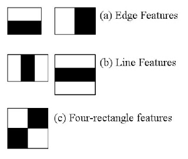
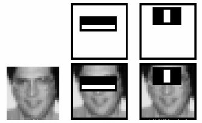
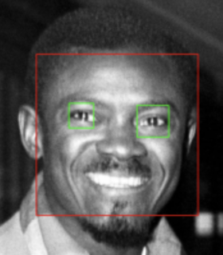
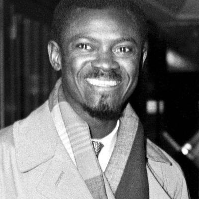

# Проект 01 – Python
## Оглавление
1. [Глава I](#глава-i) \
    1.1. [Преамбула](#преамбула)
2. [Глава II](#глава-ii) \
    2.1. [Общая инструкция](#общая-инструкция)
3. [Глава III](#глава-iii) \
    3.1. [Цели](#цели) 
4. [Глава IV](#глава-iv) \
    4.1. [Задание](#задание)
5. [Глава V](#глава-v) \
    5.1. [Сдача работы и проверка](#сдача-работы-и-проверка)

## Глава I
### Преамбула
За последние годы язык программирования Python стал одним из ключевых инструментов для анализа и визуализации больших 
массивов данных. Благодаря своей читабельности, простому синтаксису и отсутствию необходимости в компиляции, Python 
широко используется как в учебных целях, так и в профессиональной среде. Он позволяет сосредоточиться на изучении 
алгоритмов, концепций и парадигм программирования, не перегружая разработчика техническими деталями.

По данным [индекса TIOBE](https://ru.wikipedia.org/wiki/%D0%98%D0%BD%D0%B4%D0%B5%D0%BA%D1%81_TIOBE), 
Python занимает одно из первых мест среди самых популярных языков программирования в мире. Его востребованность 
особенно заметна в области анализа данных и искусственного интеллекта.

Популярность Python в сфере **Data Science** объясняется в первую очередь богатой экосистемой специализированных 
библиотек и активным сообществом разработчиков. Среди наиболее значимых инструментов можно выделить:

* **NumPy** — для работы с многомерными массивами и векторизованными вычислениями;
* **Pandas** — для обработки и анализа табличных и разнородных данных;
* **SciPy** — для решения задач научных и инженерных вычислений;
* **Matplotlib** — для построения графиков и профессиональной визуализации данных;
* **Scikit-Learn** — для решения задач классического машинного обучения;
* **OpenCV** — для компьютерного зрения: обработки изображений, распознавания объектов и видеоаналитики;
* **PyTorch** — для разработки и обучения нейронных сетей.

Однако применение Python не ограничивается только анализом данных. Он активно используется:

* для **разработки сервисов и приложений** (например, создание REST API с помощью **FastAPI** или **Django**);
* для **автоматизации тестирования** и обеспечения качества кода (библиотеки **pytest**, **unittest** и инструменты для интеграционного тестирования).

Таким образом, Python является универсальным языком, который соединяет исследовательскую работу с данными, 
машинное обучение и инженерные задачи по созданию надёжных сервисов. В ходе курса мы подробно познакомимся как с 
инструментами анализа данных, так и с практиками разработки приложений и тестирования.


## Глава II
### Общая инструкция
Методология Школы 21 может быть не похожа на тот образовательный опыт, который случался с тобой ранее. Её отличает высокий уровень автономии: у тебя есть задача, ты должен её выполнить. По большей части тебе нужно будет самому добывать знания для её решения. Второй важный момент — это peer-to-peer обучение. В образовательном процессе нет менторов и экспертов, перед которыми ты защищаешь свой результат. Ты это делаешь перед таким же учащимися, как и ты сам. У них есть чек-лист, который поможет им качественно выполнить приемку вашей работы.

Роль Школы 21 заключается в том, чтобы обеспечить через последовательность заданий и оптимальный уровень поддержки такую траекторию обучения, при которой ты не только освоишь hard skills, но и научишься самообучаться.

- Не доверяй слухам и предположениям о том, как должно быть оформлено ваше решение. Этот документ является единственным источником, к которому стоит обращаться по большинству вопросов;
- твое решение будет оцениваться другими учащимися;
- подлежат оцениванию только те файлы, которые ты выложил в GIT (ветка develop, папка src);
- в твоей папке не должно быть лишних файлов — только те, что были указаны в задании;
- не забывай, что у вас есть доступ к интернету и поисковым системам;
- обсуждение заданий можно вести и в Rocket.Chat;
- будь внимателен к примерам, указанным в этом документе — они могут иметь важные детали, которые не были оговорены другим способом;
- и да пребудет с тобой Сила!

## Глава III
### Цели
Сегодня большинство задач анализа и обработки данных решаются с помощью библиотек высокого уровня и методов 
искусственного интеллекта. Однако прежде чем углубляться в современные подходы, важно уверенно владеть 
основами языка программирования Python.

В этом проекте мы сосредоточимся на том, чтобы вспомнить синтаксис Python и научиться применять его для решения 
практических задач. Мы будем работать с базовыми структурами данных, циклами, условиями, функциями и классами, а 
также познакомимся с библиотекой NumPy и вспомним о написании тестов для проверки решений. 
В качестве практики попробуем реализовать простые алгоритмы обработки информации своими руками:

* **Создание инвертированного индекса** — задача обработки текстовых данных и поиска информации;
* **Решатель Cудоку** — пример комбинаторной задачи;
* **Обнаружение глаз на изображении** — задача обработки изображения.

Эти задания позволят не только закрепить базовые навыки работы с Python, NumPy, но и понять, 
что разнообразные прикладные задачи можно эффективно решать без сложных моделей машинного обучения 
и искусственного интеллекта.

## Глава IV
### Задание
### 0. Подготовка окружения
Для того чтобы эффективно работать с Python, особенно в проектах по Data Science, важно уметь создавать и управлять
виртуальными окружениями. Виртуальное окружение позволяет:
* Изолировать зависимости проекта — разные проекты могут использовать разные версии библиотек, не мешая друг другу;
* Избежать конфликтов версий Python и пакетов;
* Легко переносить и разворачивать проекты на других машинах.

В Python есть несколько способов создать виртуальное окружение, но самым популярным является использование 
встроенного модуля [venv](https://docs.python.org/3/library/venv.html)

#### Задание 0.1. Создание виртуального окружения
* Создай виртуальное окружение с именем **project1**.
* Активируй виртуальное окружение.
* Выведи список библиотек, установленных в новом окружении.
* Сделай скриншот командной строки, чтобы было видно и активное окружение, и список библиотек. Сохрани его в папке [assets](assets).

Сила Python во многом заключается в его богатой экосистеме библиотек. С их помощью можно быстро и эффективно решать 
задачи в Data Science, веб-разработке, автоматизации и многих других областях.

Для установки библиотек используется пакетный менеджер [pip](https://pip.pypa.io/en/stable/), который позволяет скачивать, обновлять 
и управлять зависимостями проекта внутри виртуального окружения.

#### Задание 0.2. Установка библиотек
* Убедись, что твое виртуальное окружение (project1) активировано
* Установи библиотеки `numpy` и `jupyterlab`
* Сохрани список всех установленных библиотек и их версий в файл `requirements.txt`
> **Важно:** загружать само виртуальное окружение на Git не требуется — достаточно хранить файл `requirements.txt`,
> чтобы его можно было использовать для повторного создания окружения.

#### Jupyter Lab
[**Jupyter Lab**](https://jupyter.org/) — это мощная среда для интерактивной работы с Python и другими языками 
программирования, которая особенно полезна для анализа данных.
Основные преимущества Jupyter Lab:
* Позволяет запускать код по ячейкам, что удобно для пошаговой проверки результатов;
* Можно сочетать код, текст, формулы (Markdown и LaTeX) и графики в одном документе;
* Широко используется в Data Science и машинном обучении для экспериментов и визуализации данных;
* Поддерживает расширения для работы с Git, визуализацией и интерактивными виджетами.

**Альтернатива: [Google Colab]**(https://colab.research.google.com/)
Google Colab — это облачная среда, аналогичная Jupyter Notebook, где можно:
* Работать над проектами без установки Python на свой компьютер;
* Использовать бесплатный GPU и TPU для ускорения вычислений;
* Легко делиться проектами и совместно работать с другими.

Запуск Jupyter Lab в активированном виртуальном окружении:
```shell
jupyter lab
```
После запуска откроется веб-интерфейс, где можно создавать и редактировать jupyter-ноутбуки.

Сегодняшние проекты можно выполнять в Jupyter Lab или Google Colab, в зависимости от ваших предпочтений 
и доступности ресурсов.

### 1. Инвертированный индекс
Информационный поиск (Information Retrieval) — это область компьютерных наук, которая изучает методы поиска нужной
информации в больших коллекциях данных. Классический пример — поисковые системы в интернете, которые позволяют найти 
документы, статьи или веб-страницы по ключевым словам.

Цель информационного поиска — не просто найти документы, содержащие слово, но и оценить их релевантность запросу 
пользователя. Одним из основных инструментов в информационном поиске является **инвертированный индекс**.

**Инвертированный индекс** — это структура данных, которая для каждого уникального слова хранит список документов или 
частей текста, где это слово встречается. Проще говоря, он «переворачивает» данные: вместо списка документов с их 
словами создаётся список слов с привязкой к документам.


#### Задание 1.1. Подготовка текстовых данных
* Считай текст книги **«Война и мир»** из `.txt` [файла](datasets/war_and_peace.txt).
* Раздели текст на **единицы поиска**. В этом задании будем считать единицей поиска **предложение**.
* Очисти текст от знаков препинания и приведи все слова к **нижнему регистру**.
* Разбей каждое предложение на список слов.
* Удали **стоп-слова** из [файла](datasets/stop_words_russian.txt).
* Выведи:
  * **общее количество предложений**,
  * **предложение с наибольшим количеством слов** после обработки.

#### Задание 1.2. Построение инвертированного индекса
В этом задании тебе предстоит реализовать **инвертированный индекс** для поиска слов в предложениях, 
используя класс `InvertedIndex`.

1. **Построение индекса**
   * Реализуй метод `build_index` класса `InvertedIndex`, который строит инвертированный индекс из словарного объекта `documents`.
   * `documents` — это словарь: ключ — номер предложения, значение — список слов в предложении.
   * Для каждого уникального слова сохраняй **список id предложений**, где оно встречается.
   * Используй `word2doc` для хранения данных внутри индекса.

2. **Поиск в индексе**
   * Реализуй метод поиска слов в индексе `query`.
   * Метод принимает список слов и возвращает **список id предложений**, в которых встречаются **все указанные слова** (операция «и»).
   * Результат должен быть отсортирован по возрастанию id предложения.

3. **Проверка работы индекса**
   * Проверь свой индекс на наборе слов:
   ```python
   test_words = ["мир"]
   index.query(test_words)  # должен вернуть все предложения, где встречается слово "мир"

   test_words = ["война", "мир"]
   index.query(test_words)  # должен вернуть предложения, где встречаются оба слова
   ```

### 2. Детектор глаз
До широкого распространения нейросетей многие задачи компьютерного зрения решались с помощью классических алгоритмов, 
основанных на статистических признаках и шаблонах. Одним из таких алгоритмов является [Viola-Jones](https://www.face-rec.org/algorithms/Boosting-Ensemble/16981346.pdf), который активно 
использовался для детекции лиц и глаз.

В этом задании тебе предстоит загрузить любое изображение лица, использовать каскады Хаара и библиотеку `opencv` для 
нахождения глаз и на их место поставить черные очки. 
Это позволит понять, как раньше решались задачи детекции объектов и научиться базовой обработке изображений.

#### Задание 2.1. Детекция глаз на изображении
Используя библиотеку **OpenCV** и каскады Хаара, найди глаза на изображении лица и **визуализируй их координаты**:
* Загрузи лююое изображение лица из файла (файл запуш в репозиторий в папке `datasets`)
* Примени каскад Хаара для обнаружения глаз.
* Отобрази изображение с прямоугольниками или отметками, показывающими положение глаз.
* Вывели координаты найденных глаз

| Признаки Хаара | Наложение признаков | Детекция глаз |
|---------|---------|---------|
|  |  |  |

#### Задание 2.2. Наложение очков
Используя координаты глаз из первого задания, наложи на изображение **очков** из [файла](datasets/glasses.jpg) так, 
чтобы глаза были закрыты:
* Загрузи изображение очков из [файла](datasets/glasses.jpg).
* При наложении очков избавься от **заднего фона изображения очков**, чтобы на месте глаз не было белого фона.
* Используй координаты глаз для корректного размещения очков.
* Отобрази итоговое изображение с наложенными очками

| Детекция глаз | Наложение очков  |
|---------|---------|
|  |   |

#### Задание 2.3. Анимация очков. Бонусное задание
Сделай анимацию в формате `.gif`, где очки плавно опускаются на глаза лица.
* Сгенерируй несколько кадров, постепенно перемещая очки от верхней части лица к положению глаз.
* Объедини кадры в .gif файл с плавной анимацией.
* Сохрани результат и покажи, как очки «опускаются» на лицо.




### 3. Решатель и генератор судоку
В этом задании ты научишься работать с матрицами и попрактикуешься в использовании библиотеки **NumPy**. 
Мы будем писать простой генератор и валидатор головоломок судоку.

#### Задание 3.1. Генератор судоку
1. Сначала сгенерируй случайную матрицу 9×9 с числами от 1 до 9 и проверь её на корректность с помощью функции `validate_sudoku`.
   * Валидация должна проверять:
     * нет повторов чисел в строках,
     * нет повторов чисел в столбцах,
     * нет повторов чисел в блоках 3×3.
2. Напиши несколько функций для модификации матрицы:
   * `transpose(matrix)` — транспонирует матрицу,
   * `swap_rows(matrix)` — случайным образом меняет местами строки внутри одного блока 3×3,
   * `swap_columns(matrix)` — случайным образом меняет местами столбцы внутри одного блока 3×3.
3. Возьми базовую корректную матрицу судоку и примени к ней случайную последовательность этих операций, чтобы получить новую корректную матрицу.
   После этого удали случайные клетки (замени их на нули или `None`), чтобы получилась заготовка для головоломки.
4. Проверь получившуюся матрицу функцией `validate_sudoku` и выведи результат.


### Задание 3.2. Солвер для судоку
Теперь, когда ты научился генерировать и проверять матрицы, пора написать **решатель судоку**. 
Это задание поможет тебе попрактиковаться в алгоритмах перебора и рекурсии, а также закрепить работу с тестами.

1. **Напиши функцию-решатель** для судоку 9×9.
   * Можно использовать алгоритм перебора (backtracking).
   * На вход функция получает матрицу с числами от 1 до 9 и пустыми клетками (0).
   * На выходе возвращает полностью решённую матрицу.

2. **Проверь корректность работы решателя.**
   * Напиши минимум **3 юнит-теста** с помощью библиотеки `pytest`.
   * Тесты должны проверять, что твой решатель находит правильное решение для разных входных матриц.

3. **Сравни решение с API.**
   * Используй API [youdosudoku.com](https://www.youdosudoku.com/) для генерации игры в судоку.
   * Запроси новое поле размером 9×9 с простой сложностью.
   * Прогони его через свой решатель.
   * Сравни результат с решением, которое возвращает API.
4. Выведи результат проверки в консоль: совпадает ли решение твоего солвера с эталонным решением.


## Глава V
### Сдача работы и проверка
Сохрани решение в файле 01-assignment.ipynb.\
Загрузи изменения на Git в ветку develop.

💡 [Нажми здесь](https://forms.gle/2iayfRoMCXWtVc7Z8) **чтобы отправить обратную связь по проекту**. 

