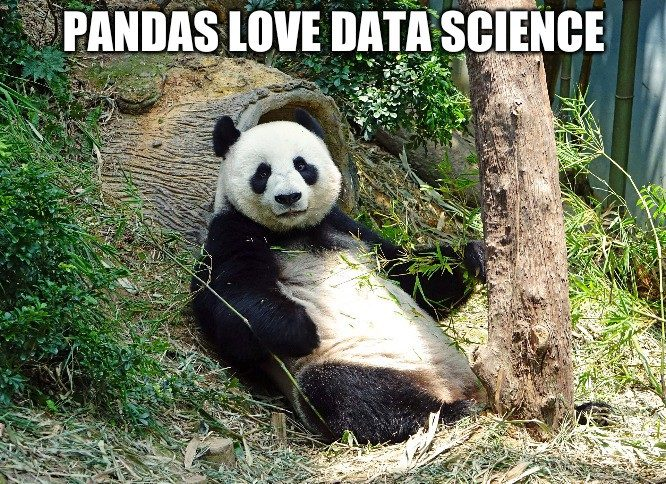
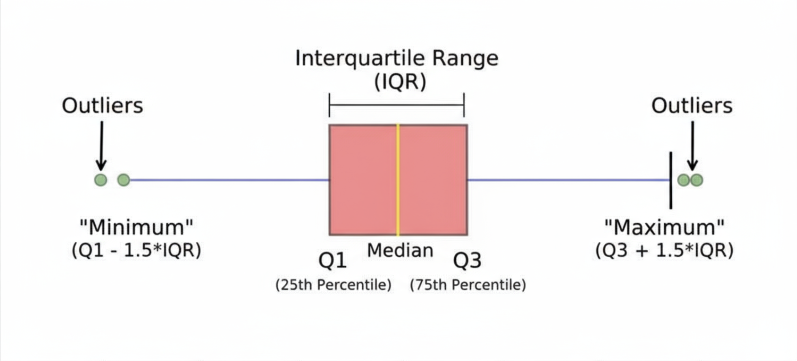

# Проект 02 – Разведочный анализ
## Оглавление
1. [Глава I](#глава-i) \
    1.1. [Преамбула](#преамбула)
2. [Глава II](#глава-ii) \
    2.1. [Общая инструкция](#общая-инструкция)
3. [Глава III](#глава-iii) \
    3.1. [Цели](#цели) 
4. [Глава IV](#глава-iv) \
    4.1. [Задание](#задание)
5. [Глава V](#глава-v) \
    5.1. [Сдача работы и проверка](#сдача-работы-и-проверка)

## Глава I
### Преамбула
**Разведочный анализ (англ. Exploratory Data Analysis, EDA)** — это один из ключевых этапов в работе с данными, который предшествует построению 
моделей и принятию решений. Его цель — понять структуру и особенности датасета: выявить закономерности, проверить 
гипотезы, найти аномалии и пропуски, оценить распределения признаков. Для этого используются описательная статистика, 
сводные таблицы, визуализация данных и методы их агрегирования.

Проведение EDA позволяет избежать ошибок при дальнейшем анализе, понять качество исходных данных и сформировать 
предположения о том, какие методы машинного обучения или статистики стоит применить. В реальных проектах на подготовку 
и исследование данных уходит до 70–80% времени, поэтому владение инструментами для анализа — критически важный навык.

В работе с табличными данными основной инструмент в Python — это библиотека **Pandas**. Она предоставляет удобные 
структуры данных и богатый набор функций для фильтрации, агрегации, преобразования и визуализации. Знание Pandas делает 
процесс проведения EDA быстрым, гибким и наглядным, что особенно важно для практикующих специалистов в сфере анализа данных.

## Глава II
### Общая инструкция

Методология Школы 21 может быть не похожа на тот образовательный опыт, который случался с тобой ранее. Её отличает высокий уровень автономии: у тебя есть задача, ты должен её выполнить. По большей части тебе нужно будет самому добывать знания для её решения. Второй важный момент — это peer-to-peer обучение. В образовательном процессе нет менторов и экспертов, перед которыми ты защищаешь свой результат. Ты это делаешь перед таким же учащимися, как и ты сам. У них есть чек-лист, который поможет им качественно выполнить приемку вашей работы.

Роль Школы 21 заключается в том, чтобы обеспечить через последовательность заданий и оптимальный уровень поддержки такую траекторию обучения, при которой ты не только освоишь hard skills, но и научишься самообучаться.

- Не доверяй слухам и предположениям о том, как должно быть оформлено ваше решение. Этот документ является единственным источником, к которому стоит обращаться по большинству вопросов;
- твое решение будет оцениваться другими учащимися;
- подлежат оцениванию только те файлы, которые ты выложил в GIT (ветка develop, папка src);
- в твоей папке не должно быть лишних файлов — только те, что были указаны в задании;
- не забывай, что у вас есть доступ к интернету и поисковым системам;
- обсуждение заданий можно вести и в Rocket.Chat;
- будь внимателен к примерам, указанным в этом документе — они могут иметь важные детали, которые не были оговорены другим способом;
- и да пребудет с тобой Сила!

## Глава III
### Цели
[Kaggle](https://www.kaggle.com) — это крупнейшая международная платформа для соревнований по анализу данных и 
машинному обучению. Помимо конкурсов, Kaggle регулярно проводит масштабные опросы среди специалистов в области Data 
Science и ML, которые позволяют получить представление о текущем состоянии индустрии, используемых инструментах, 
технологиях и карьерных траекториях. Эти данные публикуются в открытом доступе, что делает их ценным ресурсом для 
обучения и исследований.

В сегодняшнем проекте мы будем работать с результатами ежегодных опросов Kaggle за разные годы. Эти данные отражают 
динамику развития профессии Data Scientist, показывают, какие инструменты и технологии набирают популярность, и 
позволяют проследить изменения в индустрии со временем.

Наша задача — провести EDA этого набора данных. Мы будем использовать библиотеку **Pandas**, чтобы:
- познакомиться со структурой и особенностями датасета;
- изучить распределения признаков и их взаимосвязи;
- выявить закономерности, тренды и возможные аномалии;
- проследить изменения в индустрии Data Science по годам;
- получить целостное представление о профессии Data Scientist в глобальном масштабе.

## Глава IV
### Задание
### 0. Подготовка окружения
#### Задание 0.1. Настройка виртуального окружения
- Создай виртуальное окружение с именем **project2**.
- Активируй виртуальное окружение.
- Установи необходимые библиотеки из `requirements.txt`.
- Выведи список библиотек, установленных в новом окружении.
- Сделай скриншот командной строки, чтобы было видно и активное окружение, и список библиотек. Сохрани его в папке [assets](assets).

### 1. Exploratory Data Analysis
**Pandas** — это одна из самых популярных библиотек Python для работы с табличными данными. Она предоставляет удобные 
структуры данных:
* **Series** — одномерный массив с индексами, похожий на колонку в таблице;
* **DataFrame** — двумерная таблица, где каждая колонка может иметь свой тип данных.

С помощью Pandas можно: фильтровать строки и столбцы, группировать данные, агрегировать показатели, объединять таблицы, 
работать с пропущенными значениями и строить простые визуализации. Владение Pandas — базовый и необходимый навык для 
проведения EDA.

#### Задание 1.1. Загрузка данных
1. Зарегистрируйся на [Kaggle](https://www.kaggle.com/)
2. Перейди на страницу датасета [2025 Kaggle Machine Learning & Data Science Survey](https://www.kaggle.com/datasets/sonialikhan/2025-kaggle-machine-learning-and-data-science-survey)
3. Скачай CSV-файлы с данными и сохрани их в папку `datasets`
4. С помощью библиотеки `pandas` загрузи:
   * таблицу с выбором ответов (multiple choice) в переменную `multuple`
   * таблицу со свободными ответами (free form) `freeform`
5. Выведи размеры каждой таблицы
   
> **Важно:** загружать датасеты на Git не нужно.

#### Задание 1.2. Совмещение таблиц
1. Найди общие колонки в таблицах `multiple` и `freeform`. Выведи их количество
2. Определи количество уникальных значений в колонке `Q1_OTHER_TEXT` для обеих таблиц, включая `NaN`.
3. Используя метод `.update()`, дополни DataFrame `multiple` данными из DataFrame `freeform`.
4. Переименуй дополненный DataFrame в `responses`.
5. Выведи количество уникальных значений в колонке `Q1_OTHER_TEXT` для таблицы `responses`, включая `NaN`.

#### Задание 1.3. Словарь вопросов
В таблице `responses` первая строка содержит текстовые формулировки вопросов
(например: *'What is your gender? - Selected Choice'*, *'What is your age (# years)?'* и т. д.), а сами данные 
начинаются со второй строки.

1. Преврати первую строку таблицы `responses` в словарь и сохрани его в переменную `column2question`, где ключами 
будут названия колонок, а значениями — формулировки вопросов.
2. Удали эту строку из таблицы `responses`.
3. Выведи тип переменной `column2question`.
4. Выведи размерность таблицы `responses` после удаления первой строки.

#### Задание 1.4. Очистка респондентов
В данных есть информация о времени заполнения опроса. Логично предположить, что если респондент отвечал 
**слишком быстро** или, наоборот, **слишком долго**, такие ответы могут быть недостоверными. Для очистки данных 
воспользуемся методом выявления выбросов на основе **box plot**.

**Box plot (ящик с усами)** — это способ визуализации распределения данных. Внутри прямоугольника (ящика) 
находятся значения от 1-го до 3-го квартиля (Q1 и Q3), линия внутри — это медиана. «Усы» обычно определяются 
через **интерквартильный размах (IQR)**, который равен:
$$IQR = Q3 - Q1$$
Значения ниже $Q1 - 1.5 \times IQR$ и выше $Q3 + 1.5 \times IQR$ считаются выбросами.

1. Построй box plot для времени заполнения опроса. Ограничь ось **X** от 0 до 5000 секунд.
2. Рассчитай интерквартильный размах (IQR).
3. Выведи нижнюю и верхнюю границы интервала для выявления выбросов.
4. Так как нижняя граница получилась отрицательной, будем априорно считать минимальное адекватное время заполнения равным **2 минутам (120 секунд)**.
5. Отфильтруй DataFrame, оставив только респондентов с временем заполнения от 120 секунд до верхней границы.
6. Выведи размерность очищенного датасета.

#### Задание 1.5. Не популярный гендер
Обработай результаты опроса по вопросу `What is your gender?`:
1. Объедини ответы из обеих колонок
2. Удали у всех значений ведущие и завершающие пробелы
3. Приведи все ответы к нижнему регистру
4. Удали ответы, содержащие числа
5. Выведи **топ-6 самых популярных** вариантов ответа

# TODO уточнить момент с p2p Ебаллами
>Найди какой-нибудь интересный инсайт из этих данных. Напиши свои интересные инсайты в чат проекта с хэштегом #инсайт.
>Автор самого интересного инсайта получит p2p баллы. Поверь, они тебе понадобятся!

Дополнительные ресурсы для обучения приведены в файле [reading_list.md](materials/reading_list.md). \
Если же ты хочешь поделиться с сокурсниками еще какими-либо полезными материалами по теме - **смело пиши их в чат проекта!**

## Глава V
### Сдача работы и проверка
1. Сохрани решение в файле 02-assignment.ipynb
2. Загрузи изменения на Git в ветку develop, папку src/.

💡 [Нажми здесь](https://forms.gle/aY3TC52LyjygbT587) **чтобы отправить обратную связь по проекту**. 
